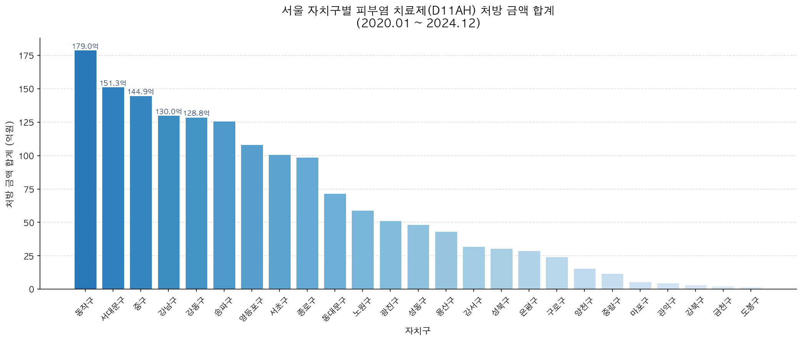
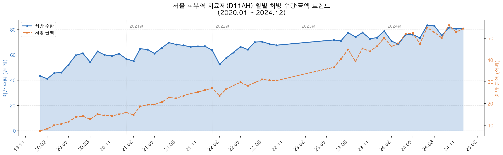
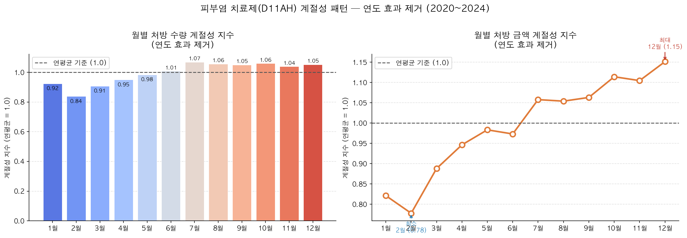
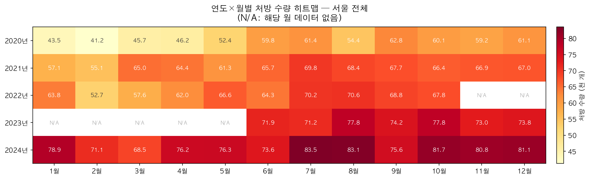

# 피부염 치료제(D11AH) 서울 시군구별 처방 데이터 분석

> 건강보험심사평가원 공공데이터를 활용한 피부과 의약품 처방 패턴 분석

---

## 프로젝트 개요

| 항목 | 내용 |
|---|---|
| **분석 대상** | ATC코드 D11AH — 피부염 치료제 (스테로이드 제외) |
| **분석 기간** | 2020년 1월 ~ 2024년 12월 (53개월) |
| **분석 지역** | 서울특별시 25개 자치구 |
| **데이터 출처** | 건강보험심사평가원 ATC코드 4단계 시군구별 처방 통계 |
| **분석 도구** | Python (pandas, matplotlib) · Jupyter Notebook |

**D11AH(피부염 치료제, 스테로이드 제외)** 카테고리에는 두필루맙(Dupilumab) 등
고가 생물학적 제제가 포함된다. 이 분석은 서울 내 처방 규모, 지역별 분포,
연간 성장 트렌드, 계절성 패턴을 정량적으로 파악하고 영업·마케팅 전략 수립에 활용 가능한
인사이트를 도출하는 것을 목적으로 한다.

---

## 주요 분석 결과

### 시장 규모 (2020~2024 누적)
- 처방 금액: **1,601.6억원**
- 처방 수량: **3,517,426개**
- 평균 처방 단가: **45,533원**

### 핵심 발견

| 발견 | 내용 |
|---|---|
| 금액 성장률 | 5년간 **+315.8%** (수량 성장 +43.6% 대비 7배 격차) |
| 2024년 급등 | 전년 대비 **+107.8%** — 고가 신약 처방 확산 |
| 시장 집중도 | 상위 5개 구가 전체 **45.8%** 점유 |
| 1위 자치구 | **동작구** (179.0억원, 11.2%) |
| 계절 성수기 | **10~12월** (12월 지수 1.151) |
| 계절 비수기 | **1~3월** (2월 지수 0.778) |

---

## 파일 구조

```
.
├── analysis.ipynb                              # 메인 분석 노트북
├── ATC코드4단계의_시군구별_202001_202412.xlsx  # 원본 데이터
├── INSIGHTS.md                                 # 상세 인사이트 문서
├── README.md                                   # 프로젝트 소개 (현재 파일)
└── output_figures/
    ├── fig1_구별_처방금액_합계.png             # 서울 구별 처방 금액 합계
    ├── fig2_월별_처방_트렌드.png               # 월별 수량·금액 트렌드
    ├── fig3_계절성_패턴.png                    # 계절성 지수 (연도 효과 제거)
    └── fig4_연도월별_히트맵.png                # 연도×월 히트맵
```

---

## 분석 내용

### 1. 데이터 전처리
- Wide → Long 변환: 월별 수량/금액 컬럼을 세로 구조로 재구성
- 53개월 × 25개 자치구 = 1,325개 레코드
- 결측 월(원본 미수록)은 NaN 유지, 집계 시 `skipna=True` 처리

### 2. 서울 구별 처방 금액 합계 (`fig1`)
25개 자치구의 5년 누적 처방 금액을 내림차순 막대그래프로 시각화.

### 3. 월별 처방 트렌드 (`fig2`)
서울 전체 합산 기준 월별 처방 수량·금액 이중 축 시계열.
2021년, 2024년 두 차례 급등 구간 확인 가능.

### 4. 계절성 패턴 분석 (`fig3`)
연도별 성장 트렌드(연도 효과)를 제거한 순수 계절성 지수 산출.

```
계절성 지수 = 각 월 값 ÷ 해당 연도 연평균
           → 연도별 지수 → 월별 평균
```

### 5. 연도×월 히트맵 (`fig4`)
연간 성장과 계절성을 동시에 파악할 수 있는 히트맵.
데이터 미수록 월은 N/A 표시.

---

## 시각화 미리보기

### 구별 처방 금액 합계


### 월별 처방 트렌드


### 계절성 패턴 (연도 효과 제거)


### 연도×월 히트맵


---

## 환경 설정

```bash
pip install pandas numpy matplotlib openpyxl nbconvert
```

```bash
# 노트북 실행
jupyter notebook analysis.ipynb

# 또는 직접 실행
jupyter nbconvert --to notebook --execute analysis.ipynb --output analysis.ipynb
```

**Python 3.9 이상 권장**
한글 폰트: macOS는 AppleGothic, Linux는 NanumGothic 자동 탐색

---

## 상세 인사이트

전략적 시사점 및 세부 분석은 **[INSIGHTS.md](INSIGHTS.md)** 참고.

---

*데이터 출처: 건강보험심사평가원 공공데이터포털*
